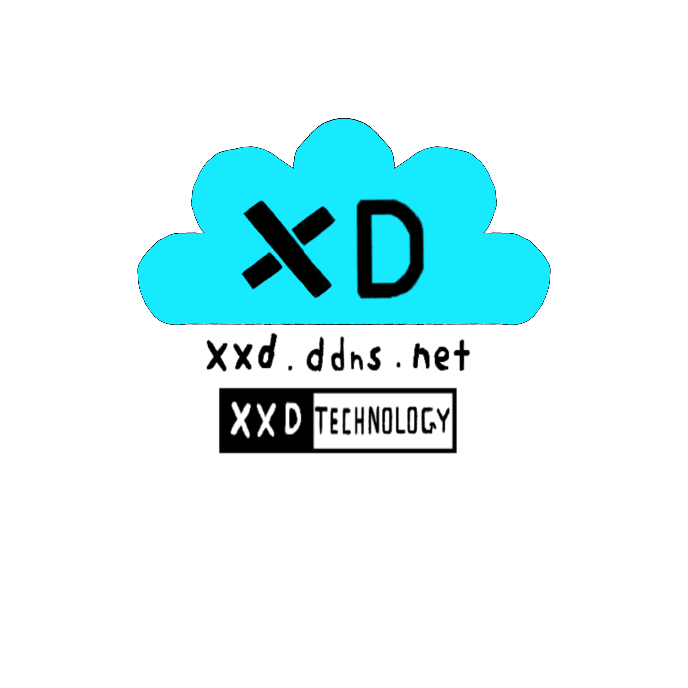

# Video Scraper



Paste a webpage or X (formerly Twitter) post link to discover videos, preview them in the app, and download the selected video.
The interface uses PyQt6, with extraction handled by yt-dlp, HTML parsing, and Qt WebEngine.

## Current Status

Current version: **3.0**, targeting macOS Apple Silicon and Windows x64. Windows runtime testing for this version is pending.

See [GitHub Releases](https://github.com/XXD051030/video-scrap/releases) for published packages and release notes.

## Features

- Discover videos from webpages and `x.com` / `twitter.com` posts, including individual videos in multi-video posts.
- Preview videos with thumbnails, duration, resolution, and source information.
- Open **Full screen** or double-click the preview; use **Esc** to return without losing playback position. Fullscreen also works before selecting a video.
- Adjust player volume from 0–100% or mute independently of system volume; each launch starts at 60%.
- Choose best, 1080p, 720p, 480p, or audio only, with progress, logs, and a custom download folder.
- Download direct media in parallel and merge HLS segments, with byte-range validation and protection against filename conflicts.
- Switch between saved dark and light themes. **More** contains **Preferences** and **About**, including the logo, version, and GitHub link.
- Configure playback read-ahead in **Preferences**: 60 seconds by default, 0–300 seconds available; 0 disables it.
- Repeated launches activate the existing window. **Browser scrape** supports pages requiring manual verification or login.

## Usage

1. Paste a link and click **Scrape**, or press Enter.
2. Select a video in the list on the left.
3. Click **Play** to preview it in the app.
4. Choose a quality setting and use **Choose…** to select the output folder if needed.
5. Click **Download current** to download the selected video.

### Audio-only Downloads

Select **audio only** under **Quality** to reveal the **Audio format** control:

| Format | Output behavior |
| --- | --- |
| Original audio (default) | Preserves the source audio encoding. Its codec determines the extension, such as `.opus`, `.m4a`, or `.mp3`. |
| MP3 | Saves `.mp3`; converts when the source is not MP3. |
| M4A | Saves AAC audio in `.m4a`; copies compatible AAC or converts other codecs. |

Conversion may reduce quality. Direct links and HLS support all three options; each queued task keeps its selected format. Sources without a separate audio stream may require the full media download first. Missing audio tracks produce an error.

FFmpeg is required and included in packaged apps. Temporary media is cleaned up after processing, cancellation, or failure; forced termination can leave files behind. Close older app windows before launching an updated version.

### X / Twitter Login

For posts requiring login, sign in to X in a supported browser, select it under **X session**, and scrape again. The app reads that session without saving your password or exporting cookies. Your account must have permission to view the post.

### File Locations

| Run mode | Default download folder |
| --- | --- |
| Running from source | `downloads/` in the current working directory |
| macOS application | `~/Downloads/Video Scraper` |
| Windows application | `%USERPROFILE%\Downloads\Video Scraper` |

Settings are stored at `~/Library/Application Support/VideoScraper/settings.json` on macOS and `%APPDATA%\VideoScraper\settings.json` on Windows.
The playback cache uses a temporary directory and is cleared on normal app exit. No database or Redis configuration is required.

## Get and Update the Repository

For a new checkout:

```bash
git clone https://github.com/XXD051030/video-scrap.git
cd video-scrap
```

To update an existing checkout, run this from the project root:

```bash
git pull --ff-only
```

`Logo.png`, build scripts, and build configurations are included in the repository. `build/`, `dist/`, virtual environments, and downloaded files are excluded by `.gitignore` and must be generated on the target system.

## Run from Source

Python 3.10+ is required; 64-bit Python 3.12 is recommended. `requirements.txt` includes `imageio-ffmpeg`, which supplies FFmpeg on supported platforms.

### macOS / Linux

```bash
python3 -m venv .venv
.venv/bin/python -m pip install -r requirements.txt
.venv/bin/python main.py
```

### Windows PowerShell

```powershell
py -3.12 -m venv .venv
.\.venv\Scripts\python.exe -m pip install -r requirements.txt
.\.venv\Scripts\python.exe main.py
```

### FFmpeg Discovery

Audio downloads, HLS remuxing, and some video merges require FFmpeg. Discovery checks system `PATH`, bundled/local build assets, then `imageio-ffmpeg`; fallback paths are also provided to yt-dlp. No executable is downloaded at runtime.

After pulling source updates, reinstall `requirements.txt` using your virtual environment's Python. Build dependencies are only needed for packaging.

If the included binary is unavailable or incompatible, install system FFmpeg. On macOS:

```bash
brew install ffmpeg
```

On Linux, use your distribution's FFmpeg package. On Windows, add the folder containing `ffmpeg.exe` to `PATH` and restart the terminal. Check discovery with:

```powershell
.\.venv\Scripts\python.exe -c "from src.ffmpeg import resolve_ffmpeg; print(resolve_ffmpeg() or 'FFmpeg not found')"
```

Packaged apps include Python and FFmpeg. Audio extraction does not require FFprobe.

## Build the macOS Application

Run these commands on macOS. For the first build, create a separate build environment:

```bash
python3.12 -m venv build/.venv
build/.venv/bin/python -m pip install -r requirements.txt -r requirements-build.txt
build/.venv/bin/python scripts/build_macos.py
```

For subsequent builds using an existing `build/.venv`, run the final command again.
The application generates an `.icns` icon from `Logo.png` and includes Python, the player, Qt WebEngine, and FFmpeg.

Output:

```text
dist/
├── Video Scraper.app
├── VideoScraper-macOS-arm64.zip
└── build-info.json
```

The current application targets Apple Silicon. The script builds for the architecture of the Python runtime used to execute it, and the ZIP filename varies accordingly.
Double-click the `.app` to run it, or move it to Applications.

### System Requirements and Validation Scope

The current package requires macOS 13+ and was tested on macOS 27.0.1. The builder checks the minimum requirements of Python, Qt, FFmpeg, and the completed app; using a newer-only Python runtime can raise the minimum OS version.

The app uses ad-hoc signing; Developer ID signing and notarization are not configured.

## Build the Windows Application

Use 64-bit Python 3.12 in a Windows x64 environment. For the first build:

```powershell
py -3.12 -m venv .venv
.\.venv\Scripts\python.exe -m pip install -r requirements.txt -r requirements-build.txt
.\.venv\Scripts\python.exe scripts\build_windows.py
```

There is no need to activate the virtual environment or change the PowerShell execution policy.
The script generates an `.ico` icon from `Logo.png` and collects Windows versions of Python, Qt WebEngine, the player, yt-dlp, and FFmpeg.

Output:

```text
dist/
├── Video Scraper/
│   ├── Video Scraper.exe
│   └── _internal/
├── VideoScraper-Windows-x64.zip
└── build-info-Windows.json
```

Double-click `Video Scraper.exe` to run it. To use it on another computer, send the complete ZIP and extract it before launching.
The `.exe` and `_internal/` folder must remain together in the same application directory. Copying only the `.exe` is insufficient.

Code signing is not configured. See the [Windows build guide (Chinese)](WINDOWS_BUILD.md) for troubleshooting. Each package must be built on its target OS; macOS cannot directly produce the Windows build.

## Offline Application Checks

Checks use temporary settings and local sample media without browser credentials. They cover downloads, HLS, audio formats, playback/fullscreen, volume, themes, About, and embedded webpages. The playback check briefly opens the app.

### macOS

```bash
"dist/Video Scraper.app/Contents/MacOS/Video Scraper" --smoke-test /tmp/video-scraper-smoke.json
cat /tmp/video-scraper-smoke.json
```

### Windows PowerShell

```powershell
$report = Join-Path $PWD "build\windows\smoke-report.json"
$appProcess = Start-Process -FilePath ".\dist\Video Scraper\Video Scraper.exe" -ArgumentList @("--smoke-test", ('"' + $report + '"')) -Wait -PassThru
$appProcess.ExitCode
Get-Content $report
```

Successful checks return exit code `0` and set `ok` to `true` in the report.
After the offline checks pass, use your own webpage or X links to verify real usage scenarios.

### Audio Source Regression Checks

With the project build environment and FFmpeg installed, run:

```bash
python tests/test_audio_downloads.py
python tests/test_audio_download_controls.py
python tests/test_ffmpeg_resolver.py
```

These checks cover audio output, packet preservation, HLS ranges, cancellation, cleanup, filenames, queued formats, controls, and FFmpeg discovery. Running them on macOS does not establish Windows compatibility.

## Logs and Build Records

| Item | Path |
| --- | --- |
| macOS build log | `build/macos/build.log` |
| Windows build log | `build/windows/build.log` |
| macOS build record | `dist/build-info.json` |
| Windows build record | `dist/build-info-Windows.json` |

Build records include Python and dependency versions, SHA-256 hashes of source files and ZIP archives, and Git commit information to help identify where an application build came from.
Build tools are pinned in `requirements-build.txt`; FFmpeg comes from [imageio-ffmpeg](https://github.com/imageio/imageio-ffmpeg).
Third-party license texts are bundled in the `third-party/` resource directory.

## Project Layout

| Path | Purpose |
| --- | --- |
| `main.py` | Application entry point |
| `src/` | Extraction, downloads, playback/cache, settings, and GUI |
| `app_bundle/` | macOS/Windows PyInstaller configurations and runtime hook |
| `scripts/` | Build scripts and packaged application checks |
| `tests/` | Regression checks |
| `Logo.png` | Shared application icon |

## Known Limitations

- Extraction, playback, and downloads depend on the media formats provided by the source, account permissions, and network conditions.
- Some yt-dlp sources provide streams that cannot be previewed directly in Qt, although downloading may still work.
- The current HLS implementation does not support some combinations of initialization segments and byte ranges, or special encrypted range formats. It reports an error rather than continuing when it cannot handle them safely.
- Earlier Windows builds were tested for startup, playback, and downloads; automated Windows regression and smoke-test reports have not been collected for 3.0.
